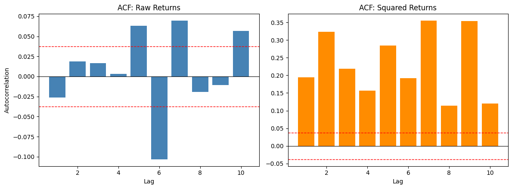

# LjungBox_ACF
Analysis of NIFTY 50 (2015–2026) logarithmic returns for autocorrelation using ACF and the Ljung-Box test, on both raw and squared returns to check for volatility clustering in the Indian market. 

## Overview
The following project tests whether NIFTY 50 (ticker: ^NSEI) log returns are autocorrelated, and to what extent. Autocorrelation is tested both directionally and in magnitude. Using raw returns allows us to check for directional autocorrelation and the usage of squared returns allows us to compare the magnitude of returns. When only the magnitude is compared, the direction of price movement is factored out in the analysis of returns. If autocorrelation in the magnitude of returns exists, volatility clustering exists within the market. So the question boils down to: can previous direction and size of price movements influence future direction and size of price movements?

## Data and Methodology
Like usual, NIFTY 50 daily closing prices are obtained using an api call on the Yahoo Finance API from the period of 2015-2026. Furthermore, log returns are calculated with the following formula using the numpy library:
```
returns = 100 * log(Close / Close.shift(1))
OR
returns = 100 * log(close price today/ Close price yesterday)
```
After the returns were calculated two tests of Autocorrelation were run on them twice. One time for raw returns and one time for squared returns (reasons defined above)
1. The **Autocorrelation Function (ACF)**
A lag period of 1-10 days was analysed. Compared against a 95% confidence interval (as plotted) the confidence intervals calculated here already assume there is no autocorrelation and are calculated using the white noise approximation:
   ```
   CI = ±1.96/√n
   ```
Although Bartlett's formula could have been utilized, the white noise approximation remains as the standard for ACF tests for comparison against pure noise.

2. The **Ljung-Box Test (LB)**
This checks if there exists, a statistically significant correlation anywhere within the lag period of 10. The Ljung-Box test is cumulative which means it tests from lag 1 to lag k jointly.

## Results
 
**ACF — Raw Returns**
 
| Lag | ACF | 95% CI | Significant? |
|---|---|---|---|
| 1 | -0.0262 | ±0.0377 | N |
| 2 | 0.0185 | ±0.0377 | N |
| 3 | 0.0168 | ±0.0377 | N |
| 4 | 0.0033 | ±0.0377 | N |
| 5 | 0.0629 | ±0.0377 | Y |
| 6 | -0.1032 | ±0.0377 | Y |
| 7 | 0.0693 | ±0.0377 | Y |
| 8 | -0.0195 | ±0.0377 | N |
| 9 | -0.0106 | ±0.0377 | N |
| 10 | 0.0565 | ±0.0377 | Y |
 
**ACF — Squared Returns**
 
| Lag | ACF | 95% CI | Significant? |
|---|---|---|---|
| 1 | 0.1938 | ±0.0377 | Y |
| 2 | 0.3234 | ±0.0377 | Y |
| 3 | 0.2189 | ±0.0377 | Y |
| 4 | 0.1562 | ±0.0377 | Y |
| 5 | 0.2840 | ±0.0377 | Y |
| 6 | 0.1914 | ±0.0377 | Y |
| 7 | 0.3545 | ±0.0377 | Y |
| 8 | 0.1136 | ±0.0377 | Y |
| 9 | 0.3533 | ±0.0377 | Y |
| 10 | 0.1200 | ±0.0377 | Y |
 
Significant ACF lags: 4/10 (raw), 10/10 (squared).
 
**Ljung-Box — Raw Returns**
 
| Lag | LB Stat | p-value | Significant? |
|---|---|---|---|
| 1 | 1.8575 | 0.1729 | N |
| 2 | 2.7838 | 0.2486 | N |
| 3 | 3.5498 | 0.3144 | N |
| 4 | 3.5801 | 0.4658 | N |
| 5 | 14.3244 | 0.0137 | Y |
| 6 | 43.2145 | 0.0000 | Y |
| 7 | 56.2764 | 0.0000 | Y |
| 8 | 57.3071 | 0.0000 | Y |
| 9 | 57.6119 | 0.0000 | Y |
| 10 | 66.2977 | 0.0000 | Y |
 
**Ljung-Box — Squared Returns**
 
| Lag | LB Stat | p-value | Significant? |
|---|---|---|---|
| 1 | 101.7976 | 0.0000 | Y |
| 2 | 385.4049 | 0.0000 | Y |
| 3 | 515.3756 | 0.0000 | Y |
| 4 | 581.5888 | 0.0000 | Y |
| 5 | 800.4440 | 0.0000 | Y |
| 6 | 899.9091 | 0.0000 | Y |
| 7 | 1241.1765 | 0.0000 | Y |
| 8 | 1276.2179 | 0.0000 | Y |
| 9 | 1615.4878 | 0.0000 | Y |
| 10 | 1654.6441 | 0.0000 | Y |
 
Significant Ljung-Box lags (cumulative test, see note above): 6/10 (raw), 10/10 (squared).

### Raw Returns
As seen with both tests, the results obtained for raw returns do not show consistency and are mostly not significant according to the p-values and the 95% CIs. In the raw return ACF only lags 5, 6, 7 and 10 exceed the confidence band with lag 6 being negative.
Key insight: since lag 5 is the first significant lag in raw returns, the LB test from and after lag 5 displays a **significant** LB stat since the lags following it (6,7) are also significant. This is a key characteristic as the LB test is cumulative.

### Squared Returns
All results of both the ACF and the LB test obtained from squared returns are significant. This means that the null hypothesis of no autocorrelation is rejected and the alternative hypothesis is accepted. Autocorrelation does exist, not in the direction of price movements but in the magnitude of price movements. Therefore, this implies that a large movement in any direction on day one (R_t) can signal a large movement in any direction the next day (R_t+1).



## Requirements
numpy pandas matplotlib yfinance statsmodels
